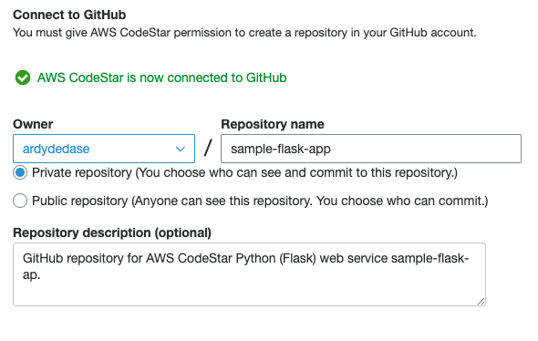
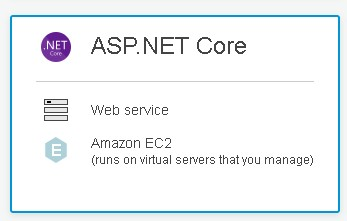
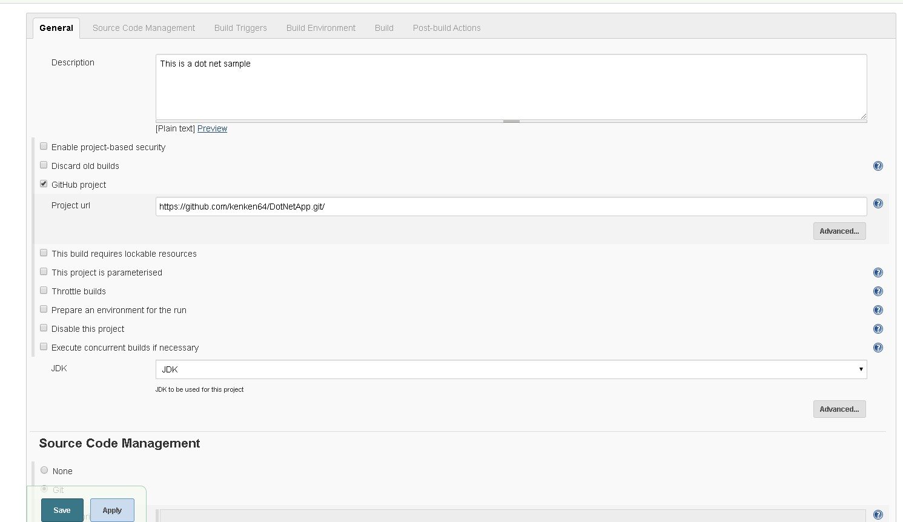
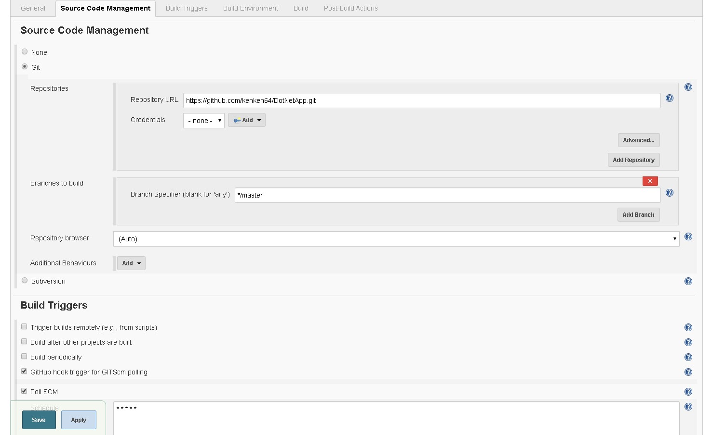
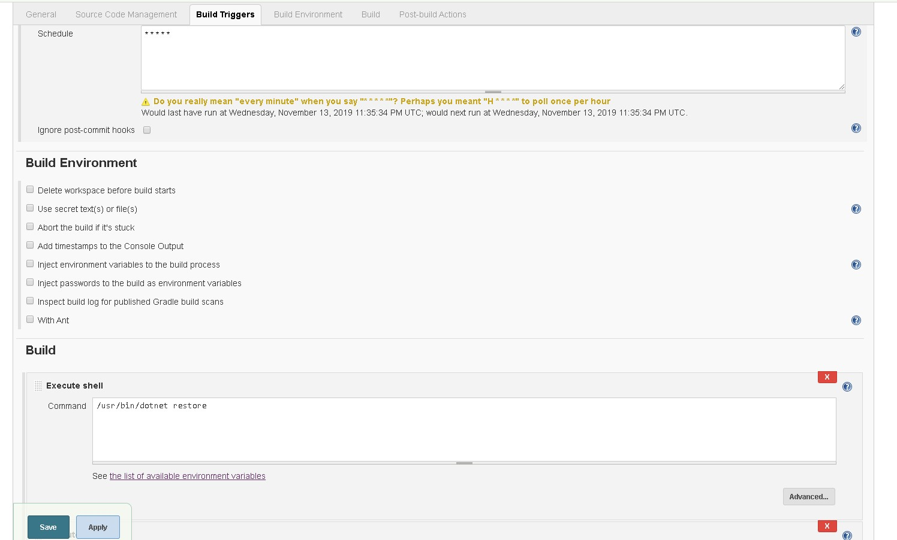
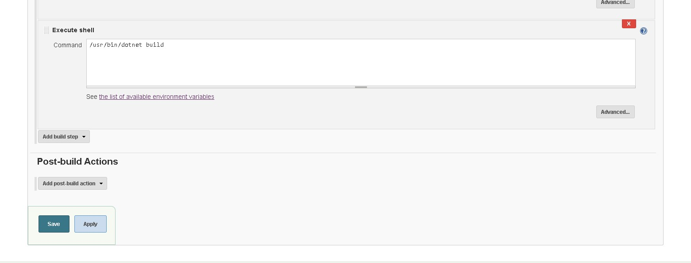

# S-DOEA - Workshop 7 - End to end DevOps Engineering and Automation

## AWS Codestar with Python Flask Project

At the end of this tutorial, you will be able to push your code changes to Github and run it in an EC2 instance deployed AWS CodeBuild.

All of AWS services in this tutorial should be in the same region Sydney (ap-southeast-2).

## Pre-requisites
- Team workshop
- Github Account
- AWS Account
- AWS Region : Sydney (ap-southeast-2)
- AWS EC2 Key Pair. [Follow this tutorial](https://docs.aws.amazon.com/AWSEC2/latest/UserGuide/ec2-key-pairs.html#having-ec2-create-your-key-pair) and take note of your Key Pair. *There is no need for us to ssh into a machine here so we can skip the `chmod` step in the guide.*

## Step by step guide - basic CodeStar setup

1. Open [AWS Codestar](https://console.aws.amazon.com/codestar/home).

1. Click "Create a new project".

1. Choose Python (Flask) Web server / Amazon EC2.

1. Enter your Project Details.

1. Choose GitHub as your repository.

1. Click "Connect to GitHub" button.

    

1. Enter your GitHub reporitory details. Select repo as public. 

    

1. After reviewing the project details, click "Create Project". This will automatically create the GitHub repository for you. You can visit GitHub afterwards to see your repository.

1. Choose the keypair that you have created in the Pre-Requisites as you Key Pair.

1. Click "Next" button, you will be redirected to the Project setup page. Try to refresh the page to see if the project setup has finished.

    


1. Capture screenshot of the successful build, save it along as part of your submission.

1. In the lower right side of the Project setup page, the application endpoint will show up when the deployment has finished loading. You can check the deployment status in the Continuous deployment section.

1. Click the Application Endpoint when it is ready and you should be able to see the JSON response of your Flask API.

1. Update your `helloworld/application.py` file to change your application's output using GitHub's web interface. Observe the deployment pipeline and refresh your Application Endpoint. You can change the following line under the `get()` method:

    ```
    return Response(json.dumps({'Output': 'Hello World from Codestar'}), mimetype='application/json', status=200)
    ```
1. Capture screenshot of the failed build, save it along as part of your submission.


## AWS Codestar integrate with Jenkins using ASP.Net Core Project template

1. Repeat the above steps 1 - 11, select 'ASP.NET Core' Web service on EC2 when creating the new codestar template wizard.

 

2. Logon to the AWS Jenkins as below:-


* Jenkins Server 
    - url : http://3.24.33.126/jenkins/


3. Create a new freestyle project item with following naming convention ```'aws_dotnet_<your initial/group name>'```

4. Configure the jenkins job as below, make sure to replace all the userid in the screenshots 
 -  Configure SCM and the build schedule trigger
 - Create 3 shell execute under the pre jenkins action
```
/usr/bin/dotnet restore

/usr/bin/dotnet build

/usr/bin/dotnet test

```


   

   

   

   

   
   

5. Capture screenshot of the successful build, save it along as part of your submission.

6. Open the Dotnet project using your favourite editor. Make changes to the dotnet test case under the following namespace ```AspNetCoreWebServiceTest/Controllers/HelloControllerTest.cs``` as below where the ```Hello World1!!!``` with an extra exclamation mark.

```
        [Fact]
        public void NoInputParamGetResponseTest()
        {
            HelloController controller = new HelloController();
            var response = controller.Get().Value as Response;
            Assert.Equal("Hello World!!!", response.output);
        }
```

7. Commit your codes to the github and watch how the build will fail.

8. Capture screenshot of the failed build, save it along as part of your submission.

9. Stabilize the test case before dockerized the app.

10. Create a Dockerfile on the root of the project directory for this dotnet project. *Hint shown  during lecturer day3.

```
from ubuntu:18.04

WORKDIR backend-svr


RUN apt-get update && \
    apt-get install -y software-properties-common && \
    apt-get install -y wget && \
    rm -rf /var/lib/apt/lists/*

RUN wget -q https://packages.microsoft.com/config/ubuntu/18.04/packages-microsoft-prod.deb

RUN dpkg -i packages-microsoft-prod.deb

RUN add-apt-repository universe

RUN apt install apt-transport-https -y

RUN apt-get update

RUN wget http://ftp.us.debian.org/debian/pool/main/i/icu/libicu57_57.1-6+deb9u4_amd64.deb

RUN dpkg -i libicu57_57.1-6+deb9u4_amd64.deb

RUN apt install dotnet-sdk-3.1 -y

COPY ./ ./

RUN dotnet restore

RUN dotnet build

EXPOSE 5000:5000

CMD [ "dotnet", "run" ]


```

11. Commit the Dockefile into your github repository.

12. Configure your jenkins's pre build step to publish this project's image to dockerhub. Use your own dockerhub username as the prefix of the image tag along with the dockerhub credentials.


13. Capture screenshot of the successful docker build and also the image is being store on the dockerhub repo, save it along as part of your submission.

14. Try accessing the app via the end point created from the CodeStar dashboard.

## Design and proposed CI CD pipeline for StoolViriiDetect Pte Ltd COVID19 - Internet of Things Project.

To detect covid19 cluster as early as possible, SG GovHighTech recently awarded StoolViriiDetect Pte Ltd the project to use their stool detection sensor solution in every residential area islandwide. The collected data should be sent to the Health Authority for analysis twice a day via a secure cloud channel. Kindly proposed an end to end CI CD pipeline for this project.

Things that the team should consider as below:-
* Public Web App and API with a geolocation-based map showing a possible cluster
* Private Web App with a map showing possible cluster and additional info
* Integrated with the trace together mobile app to notify users that a potential new cluster. (Near to realtime)
* Live update (firmware) to all the deployed sensors
* Name all the technological stacks in terms of DevOps and implementation of your proposal.
* The solution must be regional within the country. (Areas)

https://www.youtube.com/watch?v=XeFOpSNgSGk

https://www.youtube.com/watch?v=nN9d_bLE-vM&t=127s